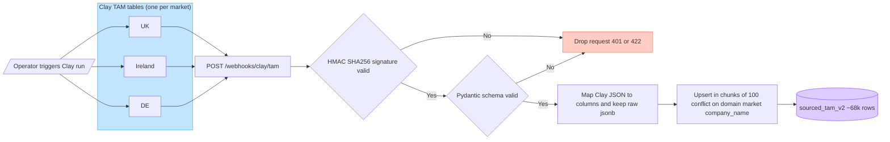
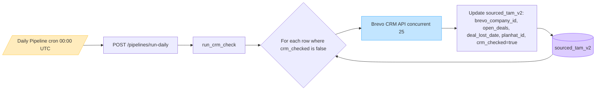
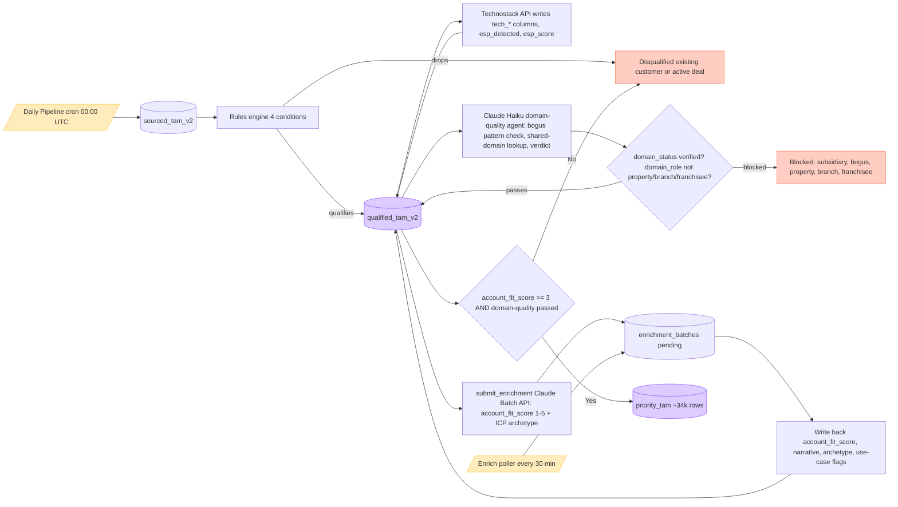
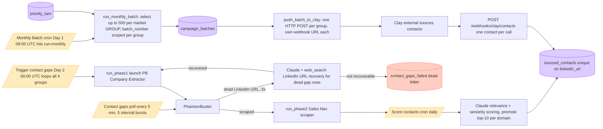
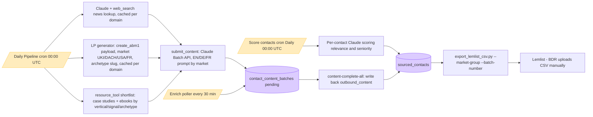
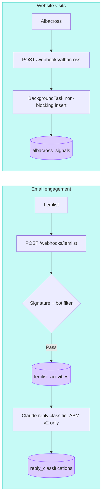
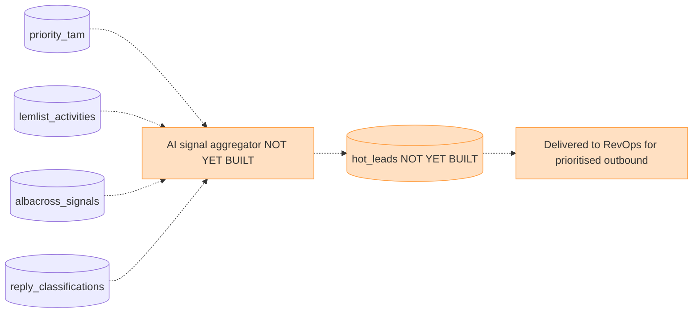

# Brevo ABM V2 — Workflow Architecture

This document is the source-of-truth diagram set for the Brevo ABM V2 outbound engine.
**Audience:** RevOps + cross-functional leadership.

**Last reconciled against the live code, DB schema, and Railway cron config: 2026-07-30.**
For implementation-level detail (exact endpoints, env vars, code patterns),
see `CLAUDE.md` and `SKILL.md` at the repo root — this document stays at the
process/diagram level for a non-engineering audience.

Every diagram below is written in Mermaid. GitHub renders Mermaid natively in this
markdown view. To export a single diagram as a PNG/SVG for a slide deck:

1. Copy the contents of any `mermaid` code block below
2. Paste into [mermaid.live](https://mermaid.live)
3. Click **Actions → PNG** (or SVG)

---

## Diagram 1 — Data Orchestration Layer (Overview)

The end-to-end value chain from raw TAM through to the planned Hot Leads handoff.
Six phases, each colour-coded. Phase 6 (orange) is the planned future state.

```mermaid
flowchart LR
    subgraph p1 ["1. Sourcing"]
        clay1[Clay TAM webhook]
        stam[(sourced_tam_v2)]
        clay1 --> stam
    end

    subgraph p2 ["2. Enrichment"]
        crm[Brevo CRM API]
    end

    subgraph p3 ["3. Qualification"]
        rules[Rules engine]
        bw[Technostack ESP detection]
        dq[Claude domain-quality gate]
        aiFit[Claude account-fit and ICP archetype]
        ptam[(priority_tam)]
    end

    subgraph p4 ["4. Outreach"]
        batch[Monthly Batch 500 per market group]
        sourcing[Clay and PhantomBuster]
        scoring[Claude contact scoring]
        content[Claude content and personalised LP]
        csv[CSV upload to Lemlist]
    end

    subgraph p5 ["5. Signals"]
        lemEvent[Lemlist events]
        albEvent[Albacross visits]
        replyAi[Claude reply classifier]
    end

    subgraph p6 ["6. Hot Leads - TO BE BUILT"]
        hot[AI score across all signals]
    end

    stam --> crm
    crm --> rules
    rules --> bw
    bw --> dq
    dq --> aiFit
    aiFit --> ptam
    ptam --> batch
    batch --> sourcing
    sourcing --> scoring
    scoring --> content
    content --> csv
    csv -.->|prospect engages| lemEvent
    lemEvent --> replyAi
    ptam -.-> hot
    lemEvent -.-> hot
    albEvent -.-> hot
    replyAi -.-> hot

    style p1 fill:#C2E5FF,stroke:#3DADFF
    style p2 fill:#CDF4D3,stroke:#66D575
    style p3 fill:#FFECBD,stroke:#FFC943
    style p4 fill:#DCCCFF,stroke:#874FFF
    style p5 fill:#C6FAF6,stroke:#5AD8CC
    style p6 fill:#FFE0C2,stroke:#FF9E42
```

---

## Phase 1 — Sourcing (detail)

**Trigger:** Operator triggers a Clay TAM table run (one table per market).
**Mechanism:** Clay POSTs each row to our webhook endpoint as soon as the table run completes.
**Output:** Rows upserted into `sourced_tam_v2` keyed on `(domain, market, company_name)`.

---

## Phase 2 — Enrichment (detail)

**Trigger:** Daily Pipeline cron at `00:00 UTC` every day.
**Mechanism:** For every `sourced_tam_v2` row where `crm_checked = false`, look up the
domain in Brevo CRM (concurrent 25). Write back the customer/deal fields plus a
`crm_checked = true` flag so subsequent runs skip already-checked rows.

---

## Phase 3 — Qualification (detail)

**Trigger:** Daily Pipeline cron continues directly after Phase 2 completes
(rules + technographic). The **domain-quality gate** and **AI enrichment**
run as separate steps — domain quality is triggered manually
(`/pipelines/domain-quality`), enrichment is submitted by the daily cron and
processed by the enrich-poller.
**Mechanism:** Rules engine drops customers + active deals → Technostack API
detects the ESP stack → a Claude Haiku agent verdicts each domain
(bogus/subsidiary/chain-brand vs. genuine independent HQ) → Claude Batch API
scores account fit (1-5) *and* one of 6 ICP archetypes → fit≥3 AND
domain-quality-passing rows promote to `priority_tam`.

**ICP Archetypes** (6, assigned by the same Claude Batch call as account fit,
with an evidence string): Graduate, Network, Consolidator, Email Specialist,
Feature Specialist, Saver. These drive both the outbound content angle (Phase
4b) and the landing page shown to that contact.

---

## Phase 4a — Batch Selection + Contact Sourcing

**Trigger:** Monthly Batch cron on Day 1 of the month at `09:00 UTC`
(hits `/pipelines/run-monthly`, not `/pipelines/monthly-batch` — the latter
exists but is manual-only).
**Mechanism:** Select up to 500 companies **per market group** — UKI
(UK+Ireland), DACH (DE+AT+CH), US, FR — from `priority_tam`, push each
group's batch to its own Clay webhook for contact sourcing. **Each market
group has its own independent `batch_number` sequence** (UKI's batch #3 and
DACH's batch #1 can coexist — the number only means something within its own
group), because the groups are pushed to Clay separately and gap-detection
needs to know which group's "batch 1" it's looking at. For companies Clay
can't source, Day 2's Contact Gaps cron kicks off the PhantomBuster fallback
(Sales Navigator scrape); companies whose LinkedIn URL turns out to be dead
get one more recovery attempt via a Claude + web_search lookup before being
archived as unrecoverable.

---

## Phase 4b — Content Generation + Activation

**Trigger:** Score contacts cron (daily 00:00 UTC) for ranking; Daily Pipeline cron
for content generation submission (both run via `BackgroundTasks` — the
news+LP prefetch phase can run for several minutes, longer than Railway's
edge proxy allows on a live connection); Enrich poller (every 30 min) for write-back.
**Scope:** Content generation is deliberately **not** run for every market at
once — `CONTENT_GENERATION_MARKETS` in code currently covers DE/AT/CH/US,
though **DACH is operationally paused** by explicit decision (check current
status before submitting DACH content — the code alone won't stop you). FR
runs via an explicit `?markets=` override and is fully live end-to-end.
**Activation:** Manual — a BDR runs `scripts/export_lemlist_csv.py
--market-group <group> --batch-number <n>` and uploads the CSV to Lemlist.
There is no programmatic Lemlist push.

---

## Phase 5 — Signals (detail)

**Trigger:** Inbound webhooks from Lemlist (every email event) and Albacross (every
identified company-level website visit).
**Downstream:** Reply classifier (Claude) runs on top of Lemlist replies to bucket
them into 10 categories (positive_meeting_request, OOF, unsubscribe, etc.) for the
UKI ABM v2 campaign only.

---

## Phase 6 — Hot Leads (FUTURE STATE)

**Status:** NOT YET BUILT.
**Plan:** Combine the four signal sources — qualification fit + email engagement +
website visits + reply intent — into a single AI-derived hot-lead score. Output a
ranked `hot_leads` table that RevOps consumes for prioritised outbound action.

---

## Appendix — Cron schedule reference

| Cron | Schedule (UTC) | Triggers | Phase served |
|---|---|---|---|
| **Daily Pipeline** | `0 0 * * *` (daily) | `/pipelines/run-daily` | Phase 2 + 3 (+ 4b content submit) |
| **Enrich poller** | every 30 min | `/pipelines/enrich-complete-all` then `/content-complete-all` | Phase 3 + 4b |
| **Score contacts** | `0 0 * * *` (daily) | `/pipelines/score-contacts` | Phase 4b |
| **Contact gaps digest** | `0 7 * * *` (daily) | `/pipelines/contact-gaps/digest` | Operational (Slack) |
| **Monthly Batch** | Day 1 @ 09:00 UTC | `/pipelines/run-monthly` | Phase 4a |
| **Trigger contact gaps** | Day 2 @ 00:00 UTC | `/pipelines/contact-gaps/run-latest` | Phase 4a |
| **Contact gaps poll** | every 5 min (Railway cron) — endpoint bursts to 5 internal cycles ≈ 1-min effective cadence | `/pipelines/contact-gaps/poll` | Phase 4a |

---

## Appendix — Webhook inventory (all inbound)

Auth is **not uniform across these four** — each was matched to what its
source system can actually do, not to one house standard.

| Endpoint | Source | Auth | Lands in | Phase |
|---|---|---|---|---|
| `POST /webhooks/clay/tam` | Clay TAM tables | HMAC-SHA256 (`X-Clay-Signature`) — **fails open** (skipped) if the secret env var is unset | `sourced_tam_v2` | 1 |
| `POST /webhooks/clay/contacts` | Clay contact sourcing (one contact per call) | Static shared secret (`X-Clay-Contacts-Secret` header) — **fails closed** if unset | `sourced_contacts` | 4a |
| `POST /webhooks/lemlist` | Lemlist | Secret is a field inside the JSON body, not a header — **fails open** if unset, plain `!=` compare | `lemlist_activities` (+ `reply_classifications` for one specific campaign) | 5 |
| `POST /webhooks/albacross` | Albacross | **None at all** — any POST is accepted; DB insert runs as a fire-and-forget background task because Albacross's own client times out under ~1s | `albacross_signals` | 5 |

No outbound webhooks. All other integrations are direct API calls we initiate:
Anthropic Claude (Batch + Messages API with `web_search`), the Technostack
technographic API, PhantomBuster, the external LP-generator service, Brevo CRM.

---

## Appendix — Out-of-band schema (not in any migration file)

The 49 migrations in `supabase/migrations/` are not a complete picture of the
live schema — a few things were applied directly in Supabase with no
corresponding migration file:

| Item | Detail |
|---|---|
| `sourced_tam_v2` | Migration 001 creates a table named `sourced_tam`. Every later migration and all pipeline code use `sourced_tam_v2` — the rename happened out-of-band. |
| `pipeline_locks` | A mutex table used by the qualification pipeline around the technographic step. No `CREATE TABLE` anywhere in the migrations. |
| 7 columns on `priority_tam` | `business_model`, `company_revenue`, `multi_entity`, `tam_segment`, `icp_archetype_primary/secondary/evidence` — added directly in Supabase; migration 049 only backfills the same columns onto `campaign_batches` for parity, and its own comment acknowledges `priority_tam` "gained these over time." |

`touchpoints`, referenced in older versions of this document, **never existed
as a real table** — it only ever appeared as prose inside Claude
content-generation prompts.

## Appendix — CRM sync (manual, not on any cron)

`scripts/run_crm_sync.py` pushes `priority_tam` rows to Brevo CRM as Company
records (PATCH if `brevo_company_id` is already known, else POST with a
self-heal website lookup to avoid creating duplicates). This is a separate,
manually-triggered process — it is not part of the daily or monthly cron
chain, and `priority_tam.brevo_company_id` is deliberately excluded from the
AI-enrichment promotion upsert (a prior run without that exclusion created
~6,000 duplicate Brevo Company records).
