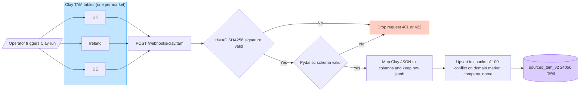
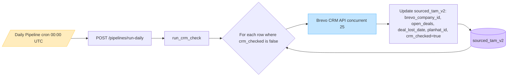
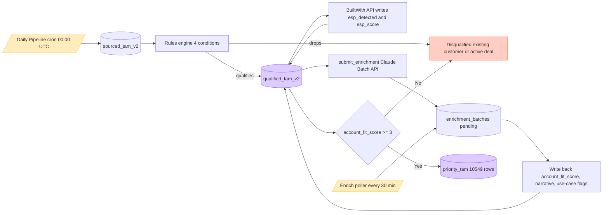
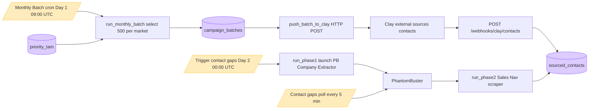
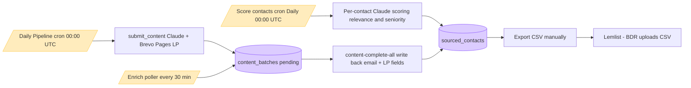
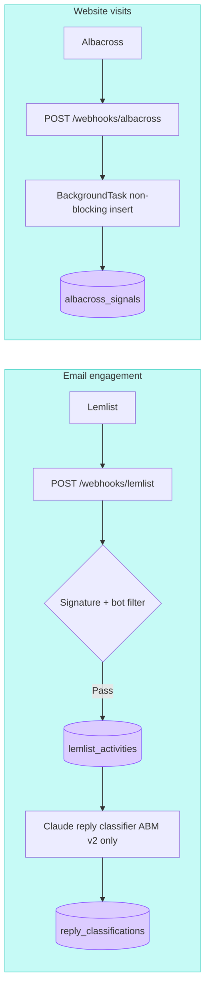
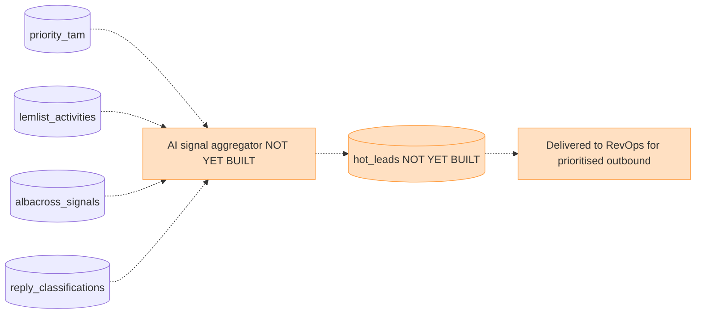

# Brevo ABM V2 — Workflow Architecture

This document is the source-of-truth diagram set for the Brevo ABM V2 outbound engine.
**Audience:** RevOps + cross-functional leadership.

Every diagram below is written in Mermaid. GitHub renders Mermaid natively in this
markdown view. To export a single diagram as a PNG/SVG for a slide deck:

1. Copy the contents of any `mermaid` code block below
2. Paste into [mermaid.live](https://mermaid.live)
3. Click **Actions → PNG** (or SVG)

---

## Diagram 1 — Data Orchestration Layer (Overview)

The end-to-end value chain from raw TAM through to the planned Hot Leads handoff.
Six phases, each colour-coded. Phase 6 (orange) is the planned future state.

```mermaid
flowchart LR
    subgraph p1 ["1. Sourcing"]
        clay1[Clay TAM webhook]
        stam[(sourced_tam_v2)]
        clay1 --> stam
    end

    subgraph p2 ["2. Enrichment"]
        crm[Brevo CRM API]
    end

    subgraph p3 ["3. Qualification"]
        rules[Rules engine]
        bw[BuiltWith ESP]
        aiFit[Claude ICP score]
        ptam[(priority_tam)]
    end

    subgraph p4 ["4. Outreach"]
        batch[Monthly Batch 500 per market]
        sourcing[Clay and PhantomBuster]
        scoring[Claude contact scoring]
        content[Claude content and Brevo Pages LP]
        csv[CSV upload to Lemlist]
    end

    subgraph p5 ["5. Signals"]
        lemEvent[Lemlist events]
        albEvent[Albacross visits]
        replyAi[Claude reply classifier]
    end

    subgraph p6 ["6. Hot Leads - TO BE BUILT"]
        hot[AI score across all signals]
    end

    stam --> crm
    crm --> rules
    rules --> bw
    bw --> aiFit
    aiFit --> ptam
    ptam --> batch
    batch --> sourcing
    sourcing --> scoring
    scoring --> content
    content --> csv
    csv -.->|prospect engages| lemEvent
    lemEvent --> replyAi
    ptam -.-> hot
    lemEvent -.-> hot
    albEvent -.-> hot
    replyAi -.-> hot

    style p1 fill:#C2E5FF,stroke:#3DADFF
    style p2 fill:#CDF4D3,stroke:#66D575
    style p3 fill:#FFECBD,stroke:#FFC943
    style p4 fill:#DCCCFF,stroke:#874FFF
    style p5 fill:#C6FAF6,stroke:#5AD8CC
    style p6 fill:#FFE0C2,stroke:#FF9E42
```

---

## Phase 1 — Sourcing (detail)

**Trigger:** Operator triggers a Clay TAM table run (one table per market).
**Mechanism:** Clay POSTs each row to our webhook endpoint as soon as the table run completes.
**Output:** Rows upserted into `sourced_tam_v2` keyed on `(domain, market, company_name)`.

---

## Phase 2 — Enrichment (detail)

**Trigger:** Daily Pipeline cron at `00:00 UTC` every day.
**Mechanism:** For every `sourced_tam_v2` row where `crm_checked = false`, look up the
domain in Brevo CRM (concurrent 25). Write back the customer/deal fields plus a
`crm_checked = true` flag so subsequent runs skip already-checked rows.

---

## Phase 3 — Qualification (detail)

**Trigger:** Daily Pipeline cron continues directly after Phase 2 completes.
**Mechanism:** Rules engine drops customers + active deals, then BuiltWith + Claude
enrich the survivors, then a fit-score threshold promotes the best fits to `priority_tam`.

---

## Phase 4a — Batch Selection + Contact Sourcing

**Trigger:** Monthly Batch cron on Day 1 of the month at `09:00 UTC`.
**Mechanism:** Select 500 per market from `priority_tam`, push the batch to Clay for
contact sourcing. For companies Clay can't source, Day 2's Contact Gaps cron kicks
off the PhantomBuster fallback (Sales Navigator scrape).

---

## Phase 4b — Content Generation + Activation

**Trigger:** Score contacts cron (daily 00:00 UTC) for ranking; Daily Pipeline cron
for content generation submission; Enrich poller (every 30 min) for write-back.
**Activation:** Manual — BDR exports CSV and uploads to Lemlist.

---

## Phase 5 — Signals (detail)

**Trigger:** Inbound webhooks from Lemlist (every email event) and Albacross (every
identified company-level website visit).
**Downstream:** Reply classifier (Claude) runs on top of Lemlist replies to bucket
them into 10 categories (positive_meeting_request, OOF, unsubscribe, etc.) for the
UKI ABM v2 campaign only.

---

## Phase 6 — Hot Leads (FUTURE STATE)

**Status:** NOT YET BUILT.
**Plan:** Combine the four signal sources — qualification fit + email engagement +
website visits + reply intent — into a single AI-derived hot-lead score. Output a
ranked `hot_leads` table that RevOps consumes for prioritised outbound action.

---

## Appendix — Cron schedule reference

| Cron | Schedule (UTC) | Triggers | Phase served |
|---|---|---|---|
| **Daily Pipeline** | `0 0 * * *` (daily) | `/pipelines/run-daily` | Phase 2 + 3 (+ 4b content submit) |
| **Enrich poller** | every 30 min | `/pipelines/enrich-complete-all` then `/content-complete-all` | Phase 3 + 4b |
| **Score contacts** | `0 0 * * *` (daily) | `/pipelines/score-contacts` | Phase 4b |
| **Contact gaps digest** | `0 7 * * *` (daily) | `/pipelines/contact-gaps/digest` | Operational (Slack) |
| **Monthly Batch** | Day 1 @ 09:00 UTC | `/pipelines/run-monthly` | Phase 4a |
| **Trigger contact gaps** | Day 2 @ 00:00 UTC | `/pipelines/contact-gaps/run-latest` | Phase 4a |
| **Contact gaps poll** | every 5 min (Railway cron) — endpoint bursts to 5 internal cycles ≈ 1-min effective cadence | `/pipelines/contact-gaps/poll` | Phase 4a |

---

## Appendix — Webhook inventory (all inbound)

| Endpoint | Source | Auth | Lands in | Phase |
|---|---|---|---|---|
| `POST /webhooks/clay/tam` | Clay TAM tables | HMAC-SHA256 (`X-Clay-Signature`) | `sourced_tam_v2` | 1 |
| `POST /webhooks/clay/contacts` | Clay contact sourcing | HMAC (TBC) | `sourced_contacts` | 4a |
| `POST /webhooks/lemlist` | Lemlist | HMAC (TBC) | `lemlist_activities` | 5 |
| `POST /webhooks/albacross` | Albacross | HMAC (TBC) | `albacross_signals` | 5 |

No outbound webhooks. All other integrations are direct API calls we initiate:
Anthropic Claude (Batch + Messages API), BuiltWith, PhantomBuster, Brevo Pages LP,
Brevo CRM.
